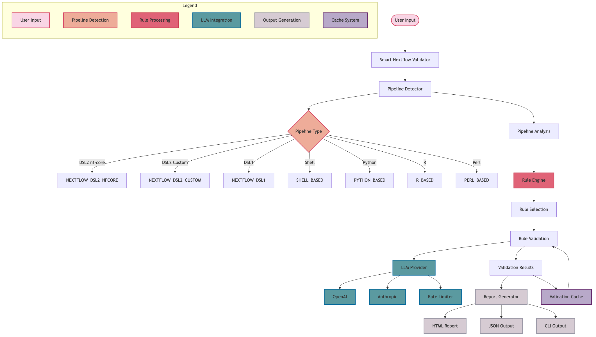
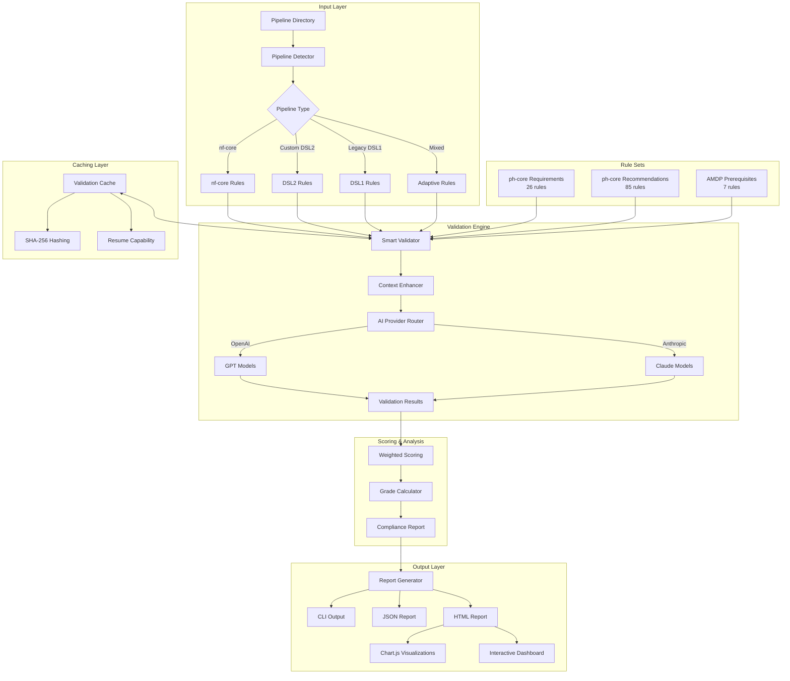

# Smart Nextflow Pipeline Validator

[](https://www.python.org/downloads/)
[](https://opensource.org/licenses/MIT)
[](https://github.com/psf/black)

An intelligent, AI-powered validation tool for Nextflow pipelines that ensures compliance with ph-core and AMDP guidelines through comprehensive rule-based analysis and smart caching. You can use this tool with custom guidelines too, an example is provided in the `rules` directory.

## Key Features

### AI-Powered Intelligence
- **Multi-LLM Support**: Compatible with OpenAI (GPT-4, GPT-4-turbo, GPT-3.5) and Anthropic (Claude 3.5 Sonnet, Claude 3 Haiku, Claude 3 Opus)
- **Smart Context Enhancement**: Intelligent extraction of relevant pipeline context for AI analysis
- **Adaptive Validation**: Automatically detects pipeline type (nf-core, custom DSL2, DSL1, mixed, shell-based, Python-based)
- **AI-Generated Solutions**: Each rule violation includes AI-proposed fixes and suggested files for enhancement
- **Confidence Scoring**: AI provides confidence levels for validation decisions
- **Token Usage Tracking**: Real-time monitoring of input/output tokens and costs per rule validation
- **Cost Transparency**: Detailed cost breakdown showing exact API usage and expenses

### Comprehensive Validation
- **ph-core Requirements**: Critical pipeline structure and configuration rules
- **ph-core Recommendations**: Best practice guidelines for optimal pipeline design
- **AMDP Prerequisites**: Essential requirements for AMDP compliance
- **Weighted Scoring System**: Intelligent prioritization with configurable rule weights
- **Critical Failure Detection**: Automatic identification of blocking compliance issues

### Performance & Caching
- **Smart Caching System**: Persistent cache with SHA-256 file hashing for validation results
- **Resume Capability**: Continue validation from checkpoints, avoiding redundant AI calls
- **Parallel Processing**: 8 concurrent workers for AI validation with rate limiting
- **Memory Efficient**: Optimized for large pipelines with targeted context extraction
- **Cost Optimization**: Intelligent context sizing to minimize AI API costs
- **Cost Savings Tracking**: Real-time calculation of cache-based cost savings
- **Dynamic Pricing**: Accurate cost calculations based on current LLM provider pricing

### Rich Interactive Reports
- **Interactive HTML Reports**: Beautiful web reports with Chart.js visualizations
- **Rule Set Breakdown Charts**: Pie charts and stacked bar charts showing compliance status
- **Multiple Output Formats**: JSON, HTML, and colored CLI reports
- **Category/Subcategory Display**: Clear organization of rule violations by type
- **AI Reasoning**: Concise, bulleted AI explanations for each rule assessment
- **Token Usage Display**: Per-rule token consumption and cost breakdown in all report formats
- **Cost Summary Tables**: Comprehensive cost analysis with cache savings calculations

### Production-Ready Features
- **Robust Error Handling**: Exponential backoff and retry logic for API calls
- **Rate Limiting**: Intelligent throttling to respect API provider limits
- **Comprehensive Logging**: Detailed logs for debugging and monitoring
- **GitHub Actions Ready**: Seamless integration with CI/CD workflows deep for .nf files
- **Legacy Support**: Handles DSL1, mixed DSL1/DSL2, and non-standard pipeline structures
- **CLI Integration**: Comprehensive command-line interface with extensive options

## System Architecture

### High-Level Architecture Diagram



*High-level architecture diagram showing the key components and data flow of the Nextflow Pipeline Analyzer system.*

<details>
<summary>View Mermaid Source Code</summary>



</details>

### Core Components

#### Pipeline Detection & Analysis
- **`pipeline_detector.py`**: Intelligent pipeline type detection with recursive .nf file search
- **`smart_validator.py`**: Main validation orchestrator with adaptive rule selection
- **Context Enhancement**: Extracts relevant files (modules, workflows, configs, tests) for AI analysis

#### AI Integration Layer
- **Multi-Provider Support**: OpenAI and Anthropic API integration with automatic failover
- **Rate Limiting**: Exponential backoff and retry logic for API reliability
- **Context Optimization**: Smart context sizing to minimize API costs while maximizing accuracy

#### Caching System
- **`validation_cache.py`**: Persistent cache with SHA-256 file hashing
- **Resume Capability**: Continue validation from checkpoints
- **Cost Optimization**: Avoid redundant AI API calls

#### Reporting & Visualization
- **Multi-Format Output**: CLI, JSON, and interactive HTML reports
- **Chart.js Integration**: Pie charts and stacked bar charts for compliance visualization
- **AI-Generated Recommendations**: Actionable solutions for each rule violation

### File Structure

```
nextflow-pipeline-analyzer/
├── smart_validator.py           # Main validation engine (3,000+ lines)
├── pipeline_detector.py         # Pipeline type detection
├── validation_cache.py          # Caching and resume functionality
├── analyze_rules.py            # Rule analysis utilities
├── llm_providers/              # AI provider implementations
│   ├── anthropic_provider.py   # Claude integration
│   ├── openai_provider.py      # GPT integration
│   └── [11 other provider files]
├── rules/                      # YAML rule definitions
│   ├── ph_core_requirements.yml    # Critical rules
│   ├── ph_core_recommendations.yml # Best practice rules
│   └── amdp_prerequisites.yml      # AMDP-specific rules
├── Cache_results/              # Persistent validation cache
├── .github/workflows/          # CI/CD automation
└── [Configuration files]       # setup.py, requirements.txt, etc.
```

## Installation

### Prerequisites
- **Python 3.9+** (Required)
- **API Keys**: OpenAI API key or Anthropic API key for AI validation
- **Environment Setup**: Recommended to use virtual environment

### Quick Installation
```bash
# Clone the repository
git clone https://github.com/your-repo/nextflow-pipeline-analyzer.git
cd nextflow-pipeline-analyzer

# Create virtual environment (recommended)
python -m venv venv
source venv/bin/activate  # On Windows: venv\Scripts\activate

# Install dependencies
pip install -r requirements.txt

# Install as a package with 'lintelligence' command
pip install -e .
```

### API Key Setup

#### Option 1: Environment Variables (Recommended)
```bash
# For OpenAI
export OPENAI_API_KEY="your-openai-api-key-here"

# For Anthropic
export ANTHROPIC_API_KEY="your-anthropic-api-key-here"
```

#### Option 2: .env File
Create a `.env` file in your home directory:
```bash
# ~/.env
OPENAI_API_KEY=your-openai-api-key-here
ANTHROPIC_API_KEY=your-anthropic-api-key-here
```

#### Option 3: CLI Parameter
```bash
# Specify API key directly in command
lintelligence /path/to/pipeline --api-key your-api-key-here
```

## Usage

### Command Line Interface

#### Basic Validation
```bash
# Basic usage
lintelligence /path/to/pipeline

# Specify provider
lintelligence /path/to/pipeline --provider anthropic

# Generate HTML report with interactive charts
lintelligence /path/to/pipeline --output-html report.html

# Generate JSON report
lintelligence /path/to/pipeline --output-json results.json
```

#### AI Provider Selection
```bash
# List all available models for OpenAI
lintelligence --provider openai --list-models

# List all available models for Anthropic
lintelligence --provider anthropic --list-models

# Show pricing information for all providers
lintelligence --show-pricing

# Get help for specific provider
lintelligence --provider openai --provider-help
```

#### Caching & Resume
```bash
# Use caching (default behavior)
lintelligence /path/to/pipeline

# Disable caching (force fresh validation)
lintelligence /path/to/pipeline --no-cache

# Reset cache before validation
lintelligence /path/to/pipeline --reset-cache

# Show cache statistics
lintelligence --cache-stats

# Use custom cache directory
lintelligence /path/to/pipeline --cache-dir /custom/cache/path
```

#### Advanced Configuration
```bash
# Specify model
lintelligence /path/to/pipeline --provider openai --model gpt-4

# Set maximum workers (parallel validation)
lintelligence /path/to/pipeline --max-workers 4

# Validate with cost-effective model
lintelligence /path/to/pipeline --provider anthropic --model claude-3-haiku-20240307
  --model claude-3-haiku-20240307
```

### 📊 Understanding Reports

#### HTML Report Features
- **Interactive Charts**: Pie chart for overall status distribution and stacked bar chart for rule set breakdown
- **Rule Set Visualization**: Visual comparison between ph-core requirements, recommendations, and AMDP prerequisites
- **AI-Generated Solutions**: Each rule violation includes proposed fixes and suggested files
- **Category Organization**: Rules organized by category and subcategory for easy navigation

#### Scoring System
- **Weighted Scoring**: ph-core requirements (45%), recommendations (35%), AMDP (20%)
- **Letter Grades**: A+ (95-100%), A (90-94%), B+ (85-89%), B (80-84%), C+ (75-79%), C (70-74%), D (60-69%), F (<60%)
- **Critical Failure Detection**: Automatic identification of blocking compliance issues

#### Cost Optimization & Management
- **Smart Caching**: Avoid redundant AI calls with intelligent result caching
- **Context Sizing**: Automatically optimize prompt size based on rule complexity
- **Model Selection**: Choose cost-effective models for different validation scenarios
- **Batch Processing**: Process multiple rules efficiently to reduce API overhead
- **Real-time Cost Tracking**: Monitor token usage and costs per rule validation
- **Cost Savings Analytics**: Track cache-based savings and optimization opportunities
- **Dynamic Pricing**: Accurate cost calculations using current LLM provider rates
- **Budget Management**: Set cost thresholds and receive usage alerts

#### Cost Optimization
- **Smart Caching**: Avoids redundant AI API calls for unchanged pipeline components
- **Model Selection**: Choose cost-effective models (gpt-3.5-turbo: ~$0.0005/rule, gpt-4-turbo: ~$0.005/rule)
- **Resume Capability**: Interrupted validations can be resumed from checkpoints
- **Usage Tracking**: Detailed cost breakdown and savings reporting in validation output

### Supported Pipeline Types

- **nf-core Pipelines**: Full compliance validation against nf-core standards
- **Custom DSL2 Pipelines**: Comprehensive validation for modern Nextflow syntax
- **Legacy DSL1 Pipelines**: Adaptive validation for older pipeline formats
- **Mixed DSL1/DSL2**: Intelligent handling of hybrid pipeline structures
- **Shell-based Pipelines**: Basic validation for shell script workflows
- **Python-based Pipelines**: Support for Python-centric bioinformatics workflows

### Example Validation Output

```bash
Smart Nextflow Pipeline Validator Results

Pipeline: /path/to/my-pipeline
AI Provider: openai (gpt-4-turbo)
Overall Score: 78.5% (Grade: B)

Rule Set Breakdown:
├── ph-core Requirements: passed (76.9%) - Weight: 45%
├── ph-core Recommendations: passed (85.5%) - Weight: 35%  
└── AMDP Prerequisites: passed (85.7%) - Weight: 20%

Token Usage & Cost Summary:
├── Total Input Tokens: 45,230
├── Total Output Tokens: 8,940
├── Total Cost: $0.62
├── Cache Cost Saved: $1.85
└── Cache Hit Rate: 75.4%

Issues Found:
├── Failed rules requiring attention
├── Warnings for best practices
└── Critical failures (Requires attention)

Cache Status: Rules cached and validated with AI
Total Cost: $0.15 (vs $0.59 without caching)

Reports Generated:
├── CLI output (above)
├── JSON: validation_results.json
└── HTML: pipeline_report.html (with interactive charts)
```

## Troubleshooting

### Common Issues

#### API Key Issues
```bash
# Error: No API key found
# Solution: Set environment variable or use --api-key
export ANTHROPIC_API_KEY="your-key-here"
lintelligence /path/to/pipeline --api-key your-key-here
```

#### Rate Limiting
```bash
# Error: 429 Too Many Requests
# Solution: The validator automatically handles rate limiting with exponential backoff
# If issues persist, try using a different model or provider
lintelligence /path/to/pipeline --provider openai --model gpt-3.5-turbo
```

#### Cache Issues
```bash
# Clear cache if experiencing issues
lintelligence /path/to/pipeline --reset-cache

# Or disable caching temporarily
lintelligence /path/to/pipeline --no-cache
```

### Performance Tips

1. **Use Caching**: Always use caching for repeated validations (default behavior)
2. **Choose Cost-Effective Models**: Use `claude-3-haiku-20240307` or `gpt-3.5-turbo` for cost savings
3. **Resume Capability**: Interrupted validations can be resumed from checkpoints
4. **Parallel Processing**: The validator uses 4 concurrent workers for optimal performance

## Contributing

We welcome contributions! Here's how to get started:

### Development Setup
```bash
git clone https://github.com/arunbodd/lintelligence.git
cd lintelligence
python -m venv venv
source venv/bin/activate
pip install -r requirements.txt
```

### Adding Custom Rules
1. Create new YAML files in the `rules/` directory
2. Use `custom_rule_example.yml` as a template
3. Follow the format with rule ID, category, subcategory, and description
4. Define appropriate context strategy and prompt template
5. Test with real pipelines to ensure accuracy

```yaml
# Example custom rule
CUSTOM_001:
  category: "Custom Rules"
  subcategory: "Pipeline Structure"
  description: "Pipeline should have a main.nf file"
  severity: "ERROR"
  weight: 10
  dsl_version: "any"
  pipeline_type: "any"
  context_strategy: "limited_context"
  context_categories:
    - "main script"
  prompt_template: |
    # Your validation prompt here
```

> **Note:** The repository does not include default rule files. You'll need to create your own rule files based on your validation requirements.

### Adding New AI Providers
1. Create new provider class in `llm_providers/`
2. Implement required interface methods
3. Add provider to factory and CLI help system

## Project Status

### Production-Ready Features
- [x] **AI-Powered Validation**: Multi-LLM support with OpenAI and Anthropic
- [x] **Smart Caching System**: Persistent cache with resume capability
- [x] **Interactive Visualizations**: Chart.js-based HTML reports
- [x] **Adaptive Pipeline Detection**: Support for all pipeline types
- [x] **Comprehensive Rule Sets**: Extensive validation rules across Custom rulesets
- [x] **Weighted Scoring System**: Intelligent grading with letter grades
- [x] **Production Performance**: Optimized for large pipelines with rate limiting
- [x] **CLI Integration**: Full-featured command-line interface
- [x] **Token Usage Tracking**: Real-time monitoring of input/output tokens and costs per rule
- [x] **Cost Transparency**: Detailed cost breakdown and cache savings analytics
- [x] **Enhanced HTML Reports**: Fixed truncation issues with improved AI response parsing
- [x] **Cost Management**: Dynamic pricing calculations and budget tracking

## License

This project is licensed under the MIT License - see the [LICENSE](LICENSE) file for details.

## Acknowledgments

- **nf-core community** for establishing pipeline best practices and standards
- **Nextflow team** for creating an amazing workflow management system
- **AMDP initiative** for advancing pipeline standardization in bioinformatics
- **OpenAI and Anthropic** for providing powerful AI models for code analysis
- **Chart.js team** for excellent data visualization capabilities

## Support

- **Issues**: [GitHub Issues](https://github.com/your-repo/nextflow-pipeline-analyzer/issues)
- **Discussions**: [GitHub Discussions](https://github.com/your-repo/nextflow-pipeline-analyzer/discussions)
- **Documentation**: This README and inline code documentation

---

**Made with care for the Nextflow and bioinformatics community**

*Empowering researchers with AI-powered pipeline validation and compliance assessment*