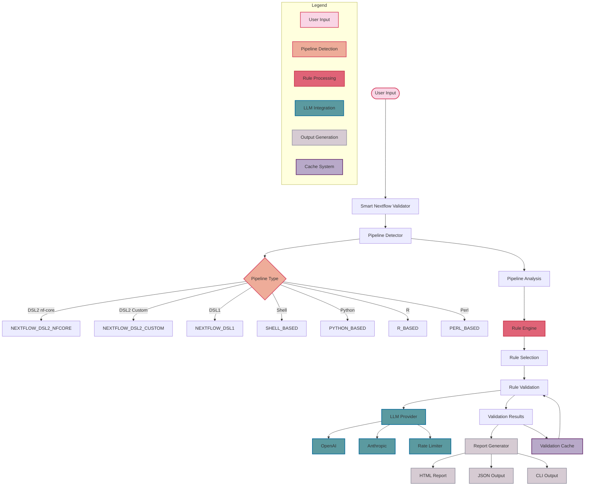

```mermaid
flowchart TD
    %% Main Components with distinctive colors
    classDef userInput fill:#f9d5e5,stroke:#d64161,stroke-width:2px
    classDef pipelineDetection fill:#eeac99,stroke:#d64161,stroke-width:2px
    classDef ruleProcessing fill:#e06377,stroke:#c83349,stroke-width:2px
    classDef llmIntegration fill:#5b9aa0,stroke:#006699,stroke-width:2px
    classDef outputGeneration fill:#d6cbd3,stroke:#9896a4,stroke-width:2px
    classDef cacheSystem fill:#b8a9c9,stroke:#622569,stroke-width:2px
    
    %% Main Flow
    User([User Input]) --> SmartValidator[Smart Nextflow Validator]
    User:::userInput
    
    %% Core Process
    SmartValidator --> PipelineDetector[Pipeline Detector]
    PipelineDetector --> PipelineType{Pipeline Type}
    PipelineType:::pipelineDetection
    
    %% Pipeline Types
    PipelineType -->|DSL2 nf-core| NFCore[NEXTFLOW_DSL2_NFCORE]
    PipelineType -->|DSL2 Custom| NFCustom[NEXTFLOW_DSL2_CUSTOM]
    PipelineType -->|DSL1| NFDSL1[NEXTFLOW_DSL1]
    PipelineType -->|Shell| Shell[SHELL_BASED]
    PipelineType -->|Python| Python[PYTHON_BASED]
    PipelineType -->|R| R[R_BASED]
    PipelineType -->|Perl| Perl[PERL_BASED]
    
    %% Analysis & Validation
    PipelineDetector --> Analysis[Pipeline Analysis]
    Analysis --> RuleEngine[Rule Engine]
    RuleEngine:::ruleProcessing
    
    %% Rule Processing
    RuleEngine --> RuleSelection[Rule Selection]
    RuleSelection --> RuleValidation[Rule Validation]
    
    %% LLM Integration
    RuleValidation --> LLMProvider[LLM Provider]
    LLMProvider --> OpenAI[OpenAI]
    LLMProvider --> Anthropic[Anthropic]
    LLMProvider:::llmIntegration
    OpenAI:::llmIntegration
    Anthropic:::llmIntegration
    
    %% Rate Limiting
    LLMProvider --> RateLimiter[Rate Limiter]
    RateLimiter:::llmIntegration
    
    %% Results Processing
    RuleValidation --> Results[Validation Results]
    Results --> ReportGenerator[Report Generator]
    ReportGenerator:::outputGeneration
    
    %% Output Formats
    ReportGenerator --> HTML[HTML Report]
    ReportGenerator --> JSON[JSON Output]
    ReportGenerator --> CLI[CLI Output]
    HTML:::outputGeneration
    JSON:::outputGeneration
    CLI:::outputGeneration
    
    %% Caching System
    ValidationCache[Validation Cache] --> RuleValidation
    Results --> ValidationCache
    ValidationCache:::cacheSystem
    
    %% Legend
    subgraph Legend["Legend"]
        UserInput[User Input]:::userInput
        PipelineDetect[Pipeline Detection]:::pipelineDetection
        RuleProc[Rule Processing]:::ruleProcessing
        LLMInt[LLM Integration]:::llmIntegration
        OutputGen[Output Generation]:::outputGeneration
        CacheSys[Cache System]:::cacheSystem
    end
```
